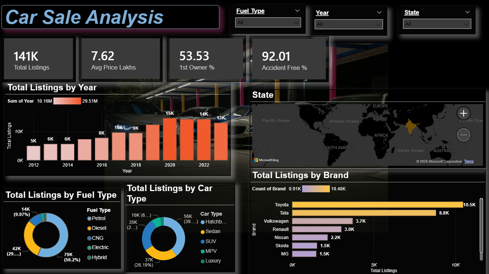
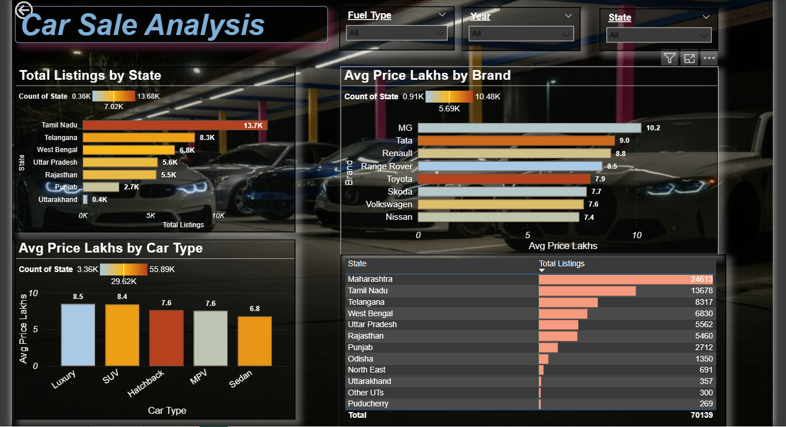

# car-sale-analysis-Dashboard[README.md](https://github.com/user-attachments/files/26459218/README.md)
# 🚗 Car Sale Analysis Dashboard — Power BI

An interactive 2-page Power BI dashboard analyzing **141,000+ used car listings** across Indian states with dynamic filters and deep insights.

---

## 📊 Dashboard Preview

### Page 1 — Overview


### Page 2 — Deep Dive Analysis


---

## 📌 Project Overview

This project analyzes the Indian used car market using real-world data. The dashboard helps users understand pricing trends, fuel preferences, brand popularity, and state-wise distribution of car listings.

---

## 📁 Pages & Features

### Page 1 — Market Overview
- **KPI Cards** — Total Listings (141K), Avg Price (7.62L), 1st Owner % (53.53%), Accident Free % (92.01%)
- **Total Listings by Year** — Trend chart from 2012 to 2023
- **Total Listings by Fuel Type** — Petrol 56%, Diesel 29%, CNG 10%, Electric & Hybrid
- **Total Listings by Car Type** — Hatchback, Sedan, SUV, MPV, Luxury
- **Total Listings by Brand** — Toyota #1 with 10.5K listings
- **India Geo Map** — State-wise listing distribution

### Page 2 — Deep Dive Analysis
- **Total Listings by State** — Tamil Nadu highest at 13.7K
- **Avg Price by Brand** — MG most expensive at 10.2L
- **Avg Price by Car Type** — Luxury tops at 8.5L
- **State-Level Data Table** — Maharashtra #1 with 24,613 listings (70K+ total records)

---

## ⚡ Dynamic Filters (Slicers)
- Fuel Type
- Year
- State

All charts update automatically when filters are applied.

---

## 🛠️ Tools & Technologies

| Tool | Usage |
|------|-------|
| Power BI Desktop | Dashboard creation & visualization |
| Power Query | Data cleaning & transformation |
| DAX | KPI measures & calculations |
| Microsoft Bing Maps | Geo map visualization |

---

## 📈 Key Insights

- **Petrol** is the most popular fuel type (56.2% of listings)
- **Toyota** has the highest number of listings (10.5K)
- **MG** has the highest average price at ₹10.2 Lakhs
- **Luxury cars** average ₹8.5 Lakhs
- **Maharashtra** has the most listings (24,613)
- Used car market grew significantly from 2018 to 2020

---

## 📂 Project Structure

```
car-sale-analysis/
│
├── CarSaleAnalysis.pbix       # Power BI Dashboard file
├── dataset/
│   └── car_sale_data.csv      # Raw dataset
├── dashboard_page1.png        # Page 1 screenshot
├── dashboard_page2.png        # Page 2 screenshot
└── README.md
```

---

## 🚀 How to Run

1. Download and install [Power BI Desktop](https://powerbi.microsoft.com/desktop/) (free)
2. Clone this repository
   ```
   git clone https://github.com/yogeshkumar/car-sale-analysis-Dashboard.git
   ```
3. Open `CarSaleAnalysis.pbix` in Power BI Desktop
4. Explore the dashboard using slicers and filters

---

## 👨‍💻 Author

**Yogesh Kumar**
- 💼 Data Analyst | Power BI | Python | SQL | Excel
- 🔗 [LinkedIn](https://www.linkedin.com/in/yogeshkumar-data-analyst/)
- 📧 yugalarya70628@gmail.com

---

## ⭐ If you found this helpful, please star this repository!
